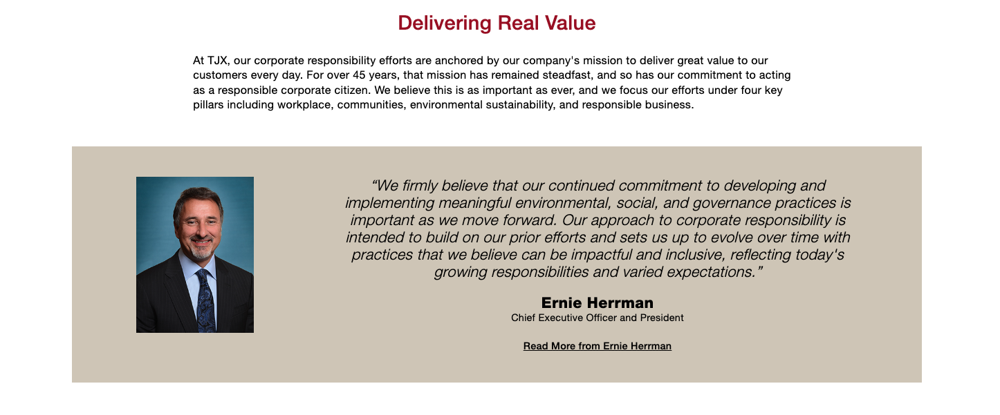

# The TJX Companies, Inc.
  

## Overview and Origin 

### Company History

TJX was discovered in `1947' by Bernard (Ben) Cammarata.

> In 1976 Ben was recruited by discount retailer, Zyre Corp. to develop and lead the 💡idea of off-price chain.  Under Mr. Cammarata’s leadership, TJ Maxx was born, with its first stores opening in 1977. In the late 1980s, Zayre was restructured and spun off three of its brands — TJ Maxx, Hit or Miss, and Chadwick’s of Boston — which served as the initial retail banners of what would become The TJX Companies, Inc. 

* Executing off-price business model  has  allowed TJX to deliver steady sales and earnings growth through many retail and economic environments. Over the course of the company history,  strong financial results and cash flow generation have allowed them to secure funds to invest in the growth of the business and return significant value to  shareholders. Company's strong sales and profitability performance in Fiscal 2024 underscores  great confidence in the outlook for their business.  

* As the leading off-price retailer of apparel and home fashions in the U.S. and worldwide, TJX delivers great value on ever-changing selections of high quality, fashionable, brand name and designer merchandise at prices generally 20%-60% below full-price retailers’ (including department, specialty, and major online retailers) regular prices, on comparable merchandise, every day.

* Its buyers are opportunistic and entrepreneurial. When a designer or manufacturer overproduces or other stores overbuy, we swoop in, negotiate the best possible price, and pass the savings on.Our buyers are on the hunt throughout the year for the hottest brand name and designer merchandise for the entire family and home — from trendy tops and handbags, to bold ties and footwear, to gourmet cookware and furniture, to hiking gear and active wear.

* TJX buy from all kinds of vendors: big brand names to boutique, designer labels, as well as up-and-coming labels and exciting gems from around the globe. They also have some merchandise manufactured for us to bring our customers exceptional fashion and quality at an amazing price. Company's buyers choose many different colors, styles, fabrics, and materials so there are always lots of great choices.

### Company Origin

 [1970s](#1970s)
 [1980s](#1980s)
 [1990s](#1990s)
 [2000s](#2000s)
 [2010s](#2010s)
 [2020s](#2020s)
    
### 1970s
    1. In 1977 first two T.J. Maxx stores open in Auburn and Worcester, Massachusetts.
    
### 1980s
    1. In 1987, Zayre forms a new entity called The TJX Companies, Inc., with T.J. Maxx, Hit or Miss, and Chadwick’s of Boston as the initial retail banners. Following Zayre’s reorganization in 1989, TJX becomes the successor company with Ben Cammarata serving as Chief Executive Officer and President.

### 1990s
    1. TJX acquires Winners Apparel of Canada, a Toronto-based chain of five off-price family apparel stores. Over time, TJX grows this chain into Canada’s largest off-price retailer of family apparel and home fashions.*
    2. TJX launches HomeGoods in the U.S., offering an eclectic selection of home fashions from around the world.
    3. TJX launches HomeGoods in the U.S., offering an eclectic selection of home fashions from around the world.
    4. TJX launches T.K. Maxx, introducing the off-price concept to the U.K. and then to Ireland. Over time, T.K. Maxx becomes Europe’s only major brick-and-mortar, off-price retailer of apparel and home fashions.
    5. TJX acquires Marshalls, the second largest off-price retailer in the U.S. At this time, Marshalls has 496 stores and offers brand name family apparel, including a broad selection of footwear and menswear. Combined, T.J. Maxx and Marshalls operate more than 1,000 stores nationwide. TJX sells the Hit or Miss chain to members of Hit or Miss management and outside investors.
    6. TJX sells Chadwick’s of Boston to more closely focus on the synergies between T.J. Maxx and Marshalls and the successful growth of its various off-price store brands.
    7. TJX launches AJWright, an off-price concept similar to T.J. Maxx and Marshalls, but aimed at a different consumer demographic.

### 2000s
    1. TJX launches HomeSense in Canada, introducing the off-price home fashions concept to that country. Similar to HomeGoods, HomeSense offers customers a wide selection of off-price home fashions.
    2. TJX acquires Bob’s Stores, a 31-store, value-oriented retailer of casual family apparel and footwear based in the Northeast region of the U.S.
    3. T.K. Maxx opens stores in Germany, introducing the off-price concept to that country.
    4. TJX brings Homesense to the U.K. with the opening of its first stores.
    5. TJX sells Bob’s Stores to private equity firms.
    6. T.K. Maxx continues its expansion in Europe with the opening of stores in Poland. T.K. Maxx launches its e-commerce site, [tkmaxx.com](https://tkmaxx.com), in the U.K.
    7. TJX announces consolidation of the AJWright division.

### 2010s
    1. TJX announces consolidation of the AJWright division.
    2. TJX launches Marshalls, one of its most successful brands, in Canada.
    3. T.J. Maxx opens its 1,000th store.  
    4. TJX acquires Sierra Trading Post (rebranded as Sierra in 2019), a U.S. off-price Internet retailer, [sierra.com](https://www.sierra.com/).
    5. T.J. Maxx launches its e-commerce site, [tjmaxx.com](https://tjmaxx.tjx.com/store/index.jsp).
    6. T.K. Maxx celebrates its 20th anniversary in Europe.
    7. Sierra opens its first two brick-and-mortar stores post-acquisition, bringing this online concept for outdoor apparel to more consumers.
    8. TJX acquires Trade Secret (rebranded to T.K. Maxx stores in 2017), an off-price retailer operating 35 stores in Australia.
    9. T.K. Maxx continues its expansion in Europe, opening stores in Austria and the Netherlands.
    10. Marshalls in the U.S. opens its 1,000th store.
    11. HomeGoods opens its 500th store.
    12. T.K. Maxx opens its 500th store in Europe.
    13. T.J. Maxx celebrates its 40th anniversary.
    14. Homesense expands in Europe, opening two stores in Ireland.
    15. Homesense opens its first U.S. store.
    16. TJX opens its 4,000th store.
    17. HomeGoods celebrates its 25th anniversary.
    18. Homesense celebrates its 10th anniversary in Europe.
    19. Marshalls in the U.S. launches its e-commerce site, [marshalls.com](https://www.marshalls.com/us/store/index.jsp).
    20. TJX opens its 500th store in Canada.

### 2020s
    In response to the COVID-19 global pandemic, TJX temporarily closes its stores, distribution centers, e-commerce websites, and offices around the globe. Starting in the spring 2020, TJX began reopening its operations while prioritizing the health and safety of its Associates and customers, including closing stores temporarily when necessary.
    1. Winners in Canada celebrates its 30th anniversary.
    2. Marshalls in the U.S. celebrates 25 years as part of The TJX family of brands.
    3. HomeSense in Canada celebrates its 20th anniversary and Marshalls in Canada celebrates 10 years.
    4. T.J. Maxx celebrates its 45th anniversary.
    5. HomeGoods celebrates its 30th anniversary. *
    6. Sierra celebrates 10 years as part of the TJX family of brands. 
    7. T.K. Maxx celebrates 15 years in Germany. 
    8. T.K. Maxx in Ireland celebrates its 10th anniversary

## 

* [Delivering Real Value💰 To The World🌎](https://www.tjx.com/company/how-we-do-it) For TJX, value is a combination of brand, fashion, price, and quality. 

* TJX operate one of the most flexible business models in the world and it has one of the widest demographic reaches in retail. TJX has 4900+ stores in 9 counteries, 6 e-commerce websites, ~349,000 associates and 80th ranked in fortune 500. 

* Being Off-price retailer of apparel and home fashions in the U.S. and worldwide, unlike more traditional retailers/competitors, they don't engage in promotional pricing activity like sales, coupons, or other gimmicks – just exciting merchandise at amazing prices, every single day!

    

* TJX has adopted wide range of advanced technologies to continue support and grow their business.  
    1. Robotic arms in warehouses and distribution centers to quickly and effectively manage the supply of goods.
    2. Two Virtual Chatbots for  external customers as well as internal IT.
    3. Microsoft CoPilot
    4. DevOps Tools to seemlessly onboard/offboard new applications
    5. ServiceNow to manage their IT services and inftrastructure. 
    
## 

At TJX, their corporate responsibility efforts are anchored by  company's mission to deliver great value to their customers every day. For over 45 years, that mission has remained steadfast, and so has their commitment to acting as a responsible corporate citizen. TJX believes this is as important as ever, and focus their efforts under four key pillars including workplace, communities, environmental sustainability, and responsible business. 

[Corporate Responsibility Pillars](https://www.tjx.com/corporate-responsibility/introduction/our-approach)

    * Their value mission extends to their corporate responsibility efforts, which are focused on supporting their Associates, giving back in the communities they serve, the environment, and operating responsibly.

## [History of Strong Performance 📈](https://investor.tjx.com/investors)

* TJX Business model has been built to have tremendous flexibility and adapt with the times. Throughout their 47-year history as a Company, they have maintained an unwavering focus on executing our off-price business model which has generally allowed them to deliver steady sales and earnings growth through many retail and economic environments.  
     
* As TJX pursue their long-term goals for global growth, their major strengths are as the following:

      👉 One of the most flexible retail business models in the world
      👉 Their value proposition appeals to customers spanning a wide demographic reach
      👉 World-class buying organization
      👉 Global sourcing and distribution capabilities
      👉 Integrated global business with all major divisions having at least 30 years of off-price operating expertise and knowledge in the U.S., Canada, and Europe
    
## Recommendations    

* Use of GenAI -  As a global retailer and ~390,000 associates, use of GenAI will make company follow newer fashion trends, and target right set of customers, and/or resolve any recurring issues.

* Retail IT Solutions -  help to grow their business and increase loss prevention.  

##   

## 
